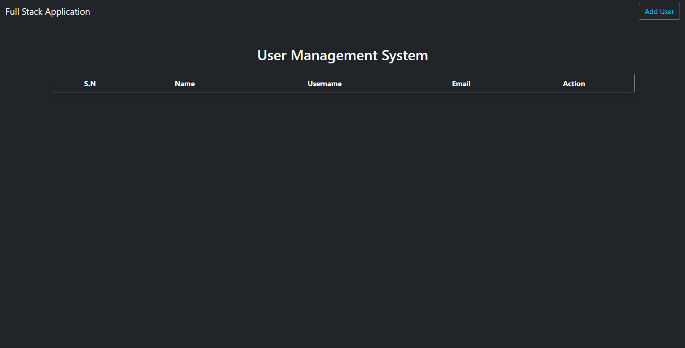
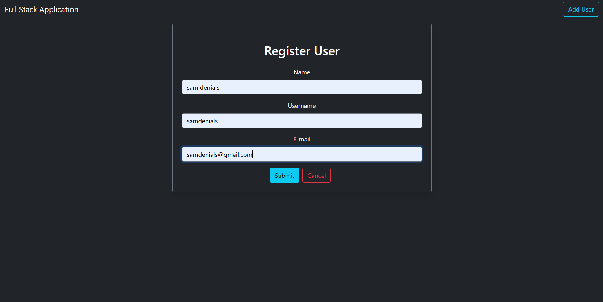
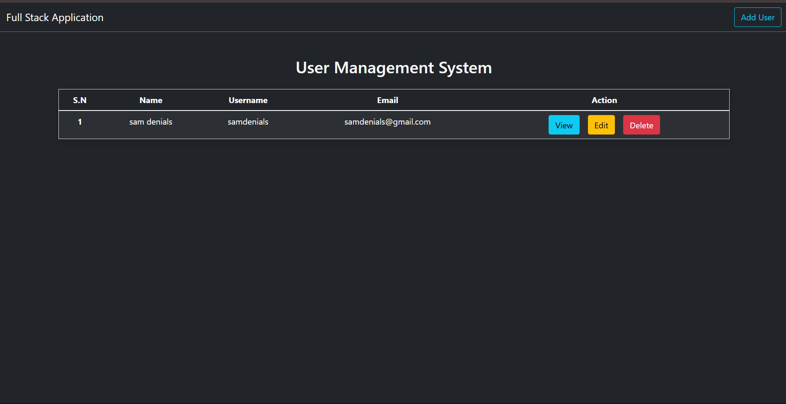
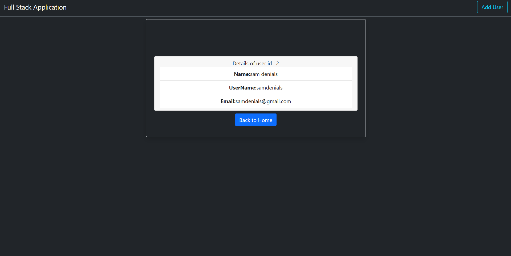

# Full Stack User Management System

This is a full-stack application built with Spring Boot (Backend) and React (Frontend) for managing users.

## Demo

### Screenshots
1. **Home Page**
   
   *Main dashboard showing the list of users*

2. **Add User**
   
   *Form to add a new user*

3. **Edit User**
   
   *Form to edit existing user details*

4. **View User**
   
   *Detailed view of a single user*

## Tech Stack

### Backend
- Java Spring Boot
- MySQL Database
- Spring Data JPA
- Maven

### Frontend
- React.js
- Axios for API calls
- Bootstrap for styling
- React Router for navigation

## Prerequisites

- Java JDK 17 or higher
- Node.js and npm
- MySQL Server
- Maven

## Local Development Setup

### Backend Setup
1. Navigate to the backend directory:
   ```bash
   cd backend
   ```
2. Create a `.env` file in the backend directory with your database configuration:
   ```properties
   SPRING_DATASOURCE_URL=jdbc:mysql://localhost:3306/your_database_name
   SPRING_DATASOURCE_USERNAME=your_username
   SPRING_DATASOURCE_PASSWORD=your_password
   ```
3. Run the Spring Boot application:
   ```bash
   ./mvnw spring-boot:run
   ```
   The backend will be available at `http://localhost:8080`

### Frontend Setup
1. Navigate to the frontend directory:
   ```bash
   cd frontend
   ```
2. Create a `.env` file in the frontend directory:
   ```
   REACT_APP_API_URL=http://localhost:8080
   ```
3. Install dependencies:
   ```bash
   npm install
   ```
4. Start the development server:
   ```bash
   npm start
   ```
   The frontend will be available at `http://localhost:3000`

## Deployment

### Frontend Deployment (Vercel)
1. Create a `vercel.json` file in your frontend directory:
   ```json
   {
     "rewrites": [
       {
         "source": "/api/:path*",
         "destination": "${REACT_APP_API_URL}/:path*"
       }
     ]
   }
   ```

2. Install Vercel CLI:
   ```bash
   npm install -g vercel
   ```

3. Login to Vercel:
   ```bash
   vercel login
   ```

4. Deploy the frontend:
   ```bash
   cd frontend
   vercel
   ```

### Backend Deployment
For the backend, you have several options:

1. **Railway.app** (Recommended for Spring Boot):
   - Create an account on Railway.app
   - Connect your GitHub repository
   - Add a new service and select your backend directory
   - Configure environment variables for database connection
   - Deploy

2. **Render.com**:
   - Create an account on Render.com
   - Create a new Web Service
   - Connect your GitHub repository
   - Set build command: `./mvnw clean package`
   - Set start command: `java -jar target/fullstack-backend-0.0.1-SNAPSHOT.jar`
   - Configure environment variables
   - Deploy

## Security Notes

1. **Environment Variables**
   - Never commit `.env` files to version control
   - Add `.env` to your `.gitignore` file
   - Use environment variables for all sensitive information

2. **Database Security**
   - Use strong passwords
   - Enable SSL for database connections
   - Restrict database access to specific IP addresses

3. **API Security**
   - Enable CORS only for specific origins
   - Use HTTPS in production
   - Implement proper authentication and authorization

## Features
- User CRUD operations
- Responsive design
- RESTful API
- Database persistence
- Modern UI with Bootstrap

## Contributing
Feel free to submit issues and enhancement requests.

## License
This project is licensed under the MIT License. 
